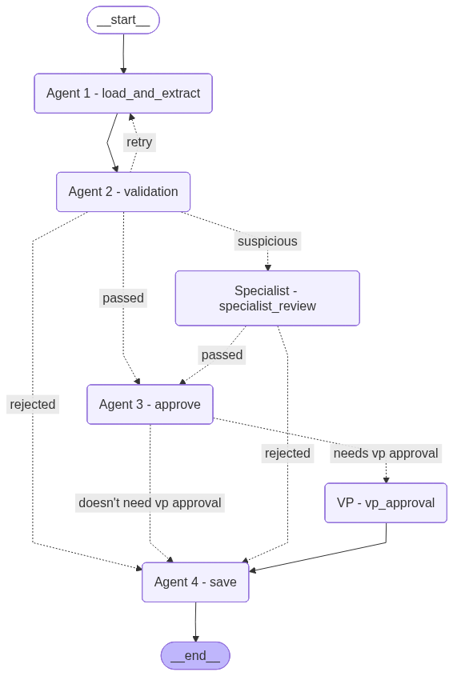

# Invoice Processing Agent

An AI-powered invoice processing pipeline built with LangGraph and xAI Grok. The system extracts structured data from invoices, validates them against inventory and vendor records, routes borderline cases to human reviewers, and triggers payment on approval.

---

## Pipeline Graph



---

## Key Libraries

| Library | Purpose |
|---|---|
| **LangGraph** | Orchestrates the multi-node agent graph with interrupt/resume support for human-in-the-loop |
| **LangChain OpenAI** | Connects to the xAI Grok model via the OpenAI-compatible API for extraction and approval decisions |
| **Streamlit** | Review UI for human decisions (specialist and VP) and live pipeline dashboard |
| **PyMuPDF** | Extracts text from PDF invoices |
| **SQLite** | Persists invoices, inventory, vendor list, pending reviews, and LangGraph checkpoints |

---

## How to Run

### Prerequisites

Set your xAI API key — either export it in your shell or add it to a `.env` file in the project root:

```bash
export XAI_API_KEY=xai-xxxxxxxxxxxxxxxx
# or
echo "XAI_API_KEY=xai-xxxxxxxxxxxxxxxx" > .env
```

Install dependencies:

```bash
pip install -r requirements.txt
```

---

### Launch the review UI

```bash
python -m streamlit run ui.py
```

The UI has four tabs:

- **Command Center** — live pipeline stats: invoice status breakdown, human review outcomes, top vendors, recent decisions
- **Specialist Validation** — invoices flagged for specialist review (suspicious item names, unknown vendors)
- **VP Review** — invoices requiring VP sign-off (amounts over $10,000 or uncertain authenticity)
- **History** — all processed invoices and their final outcomes

---

### Run a single invoice

```bash
python main.py --invoice_path data/invoices/invoice_1001.txt
```

If an invoice requires human review, the agent pauses and prints a message. Open the UI (see above) to make a decision.

---

### Run all invoices in a directory

```bash
python test_pipeline.py
```

By default this processes all files in `data/invoices/`. Pass a custom directory with:

```bash
python test_pipeline.py --invoices_dir path/to/invoices
```

> **Note:** `test_pipeline.py` clears both databases before each run so results are always fresh. If an invoice is paused for human review, the script polls every 3 seconds until a decision is made via the UI.

---

## Key Assumptions

### Extraction
- Invoice amounts are normalised to plain numbers (currency symbols and commas stripped).
- Dates are normalised to `YYYY-MM-DD` where possible; ambiguous dates are preserved as-is.
- If a required field (vendor, amount, line items) is missing on the first extraction attempt, the agent retries once with targeted feedback to the LLM before continuing.

### Validation
- Line items are matched against the inventory by exact name. Names that fuzzy-match a known item (≥ 0.6 similarity) but aren't identical are flagged as possible typos and routed to the specialist.
- Items with parenthetical qualifiers (e.g. `WidgetA (rush fee)`) are treated as suspicious and routed to the specialist.
- A vendor not present in the approved vendor list is flagged as unknown and routed to the specialist rather than auto-rejected.
- Duplicate invoices (same `invoice_id`, same file) are silently skipped. A different file with the same `invoice_id` is treated as a revision — only the delta over the previously paid amount is charged.
- If a prior version of an invoice required human review, any subsequent version with the same `invoice_id` is automatically rejected without triggering a new human review.

### Approval
- Invoices over $10,000 always require VP review.
- The approval agent can also escalate to VP if it is uncertain about vendor legitimacy or invoice authenticity.
- Outright rejection (no human review) is reserved for clearly fraudulent vendors, nonsensical due dates, or obvious data integrity issues.

### Payment
- Payment is simulated (`mock_payment`) — no real funds are transferred.
- For revised invoices, only the delta between the new total and the previously paid amount is charged.
- Vendor status is not dynamically updated after payment; the approved vendor list is managed separately.

### Data
- All state is persisted in SQLite: `data/inventory.db` for business data and `data/checkpoints.db` for LangGraph graph state.
- The inventory table is seeded with four items: `WidgetA` (15 units), `WidgetB` (10 units), `GadgetX` (5 units), `FakeItem` (0 units).
- The vendor table is pre-seeded with a list of known vendors and supports fuzzy matching at 80% similarity.
